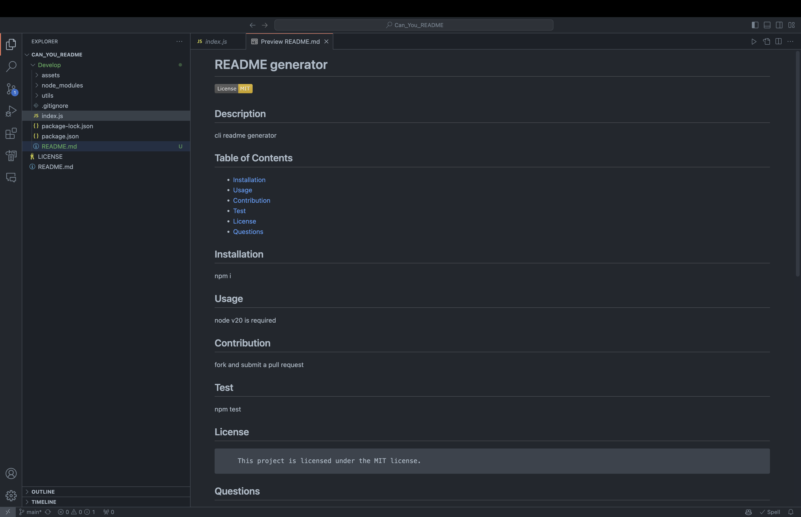
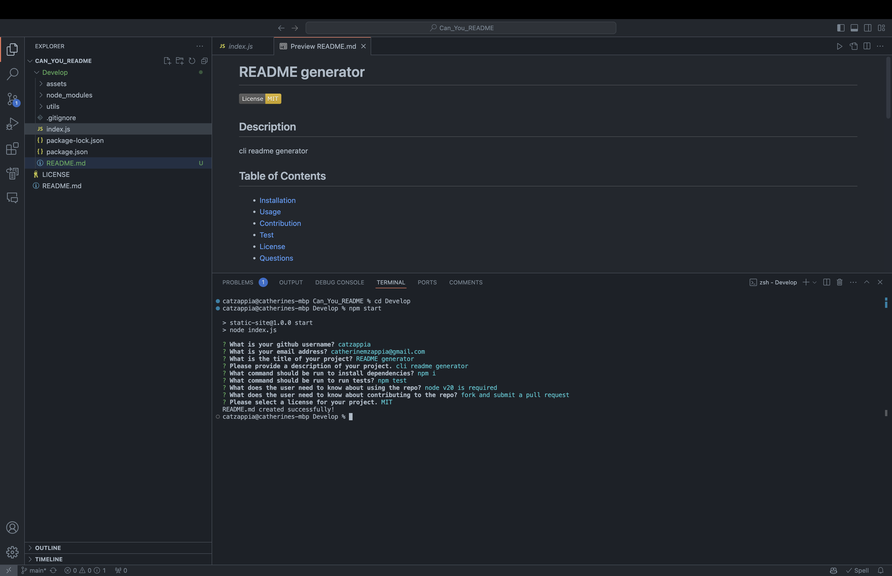

# Can_You_README
An application to generate a high-quality README that meets githubs' professional criteria. 

## Description

- I find READMEs to be difficult to write from scratch. Starting out, I had no idea what I was supposed to include other than a few lines explaining what the repository was for and what it was meant to accomplish. 
-  I know for a fact that there are other developers like me--either just starting out or trying to become more comfortable and familiar with github in general--that could use a README generator to help streamline their repository creation. Not to mention, it provides one less thing to stress over during the coding process! 
- I learned how fun javascript, node, and inquirer could be! Not to mention the seemingly endless uses for these programs. Perhaps I'll dabble with them more in the (not-so-distant) future.

## Table of Contents

- [Installation](#installation)
- [Usage](#usage)
- [Credits](#credits)
- [License](#license)
- [Features](#features)
- [How to Contribute](#how-to-contribute)
- [Tests](#tests)

## Installation
Requires
```
npm install
```
this project uses the [Inquirer Package](https://www.npmjs.com/package/inquirer)
Node v20 is required!

It was built using MacOS Sonoma 14.5


## Usage



- [Video](https://drive.google.com/file/d/1PEPIOvWlHH2nx9if9gOVglJrlUyIQBVA/view?usp=sharing)
- to view the sample README file generated by the application, go [here](Develop/Sample_README.md)

# Executing the Program
1. Open coding software and load in Can_You_README files
2. Navigate to the terminal
3. Run
  ```
  npm start
  ```
4. Answer the questions posed by the terminal
5. If all questions were answered properly, the application will generate a high-quality README.md file!

## Credits
Inquirer.js belongs to [Simon Boudrias](https://www.github.com/SBoudrias)
Starter code belongs to BootcampSpot/EdX/Rutgers. 

## License

---
## Authors
Catherine Zappia | [Github](https://www.github.com/catzappia)   [e-mail](catherinemzappia@gmail.com)

## Version History
- 0.1
  - Initial Release.

## Tests
to run a test, run the following command
```
npm test
```
